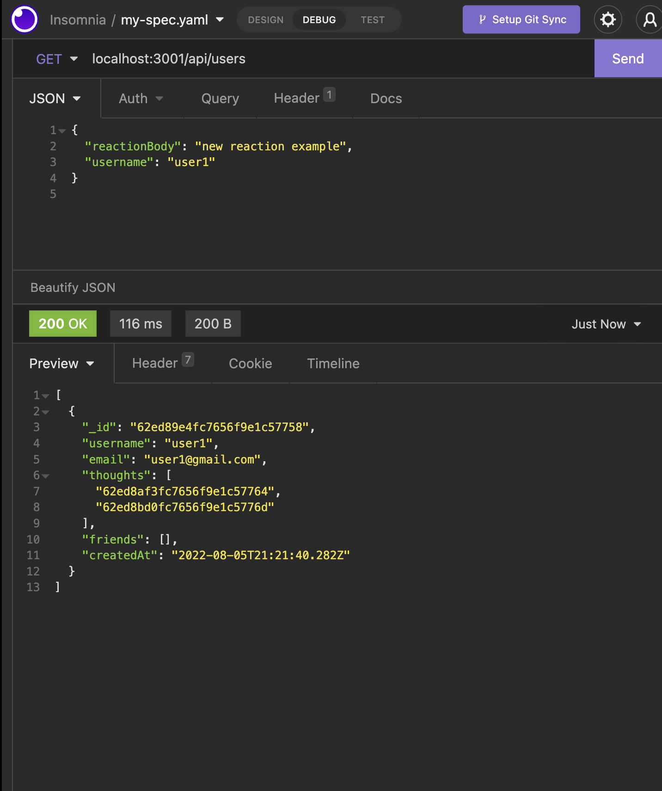
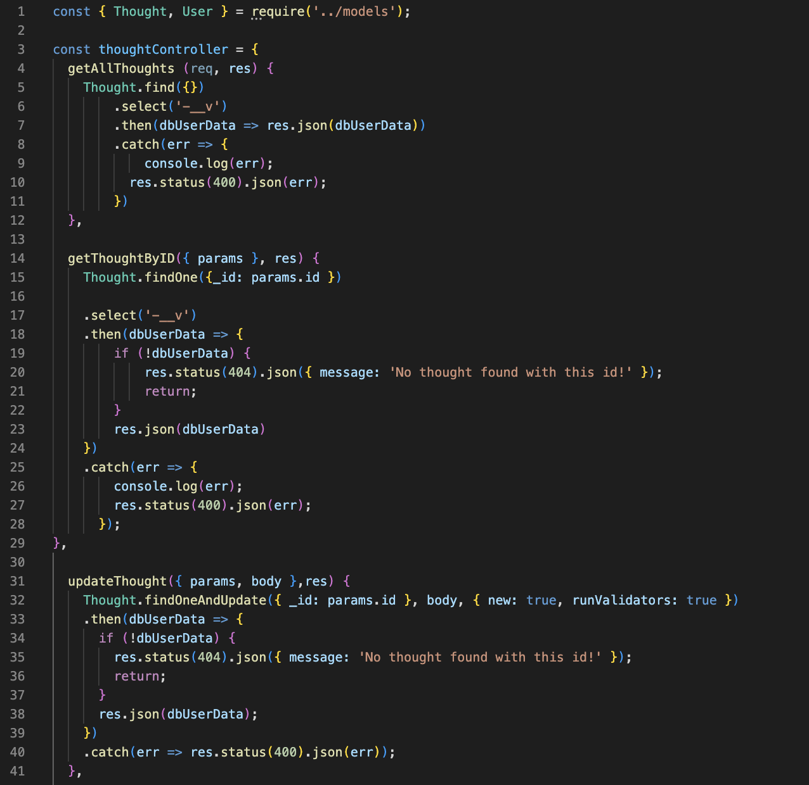
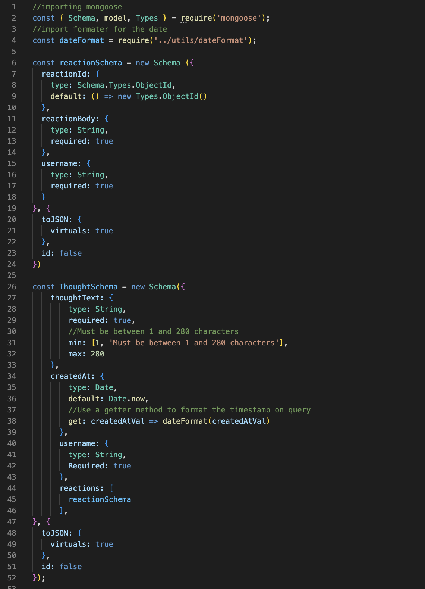
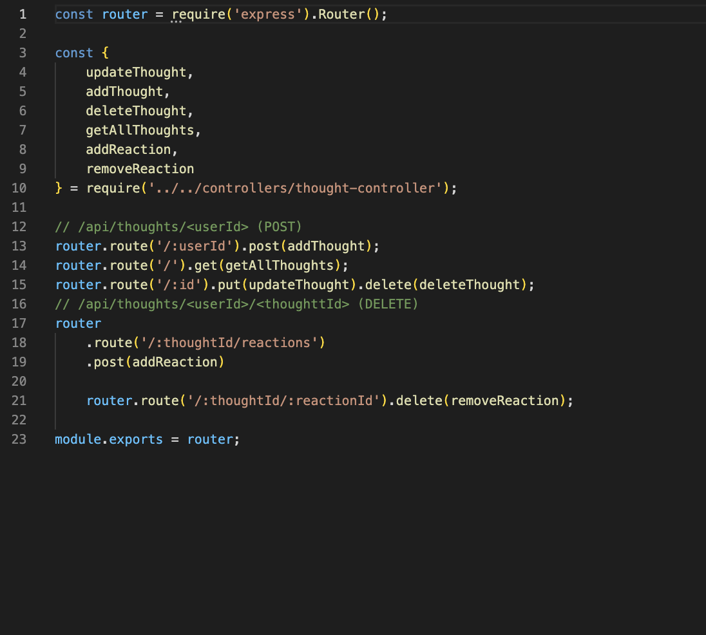
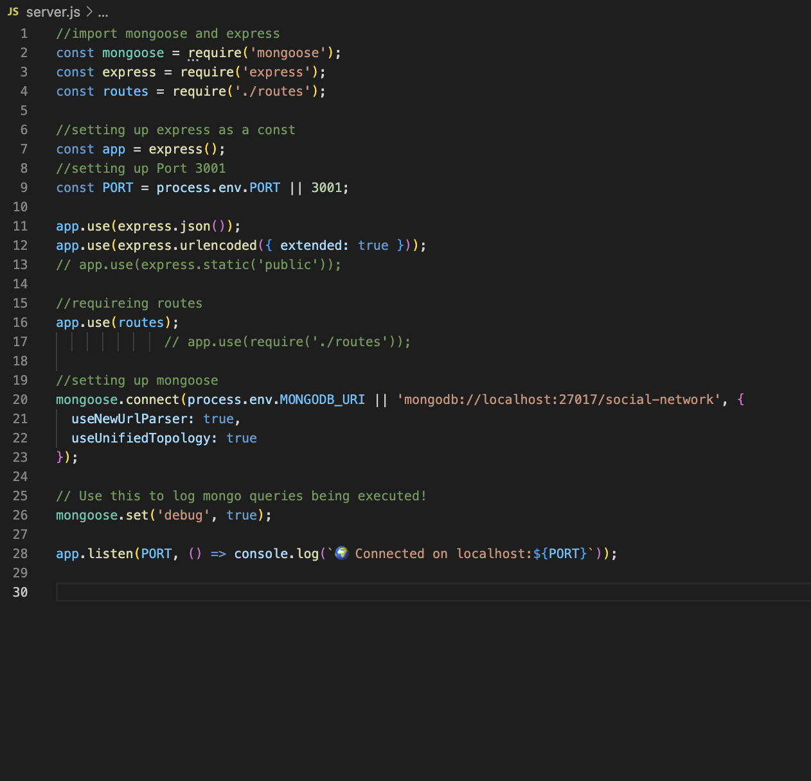

# Social-Network-API

- [instalation](#instalation)
- [usage](#usage)
- [contribution](#contribution)
- [tests](#tests)

  ## description 
  Social-Network-API is a web application that allows the creation of users, posting of thoughts, reaction to these thoughts and the ability to make connect with other users. Users can also edit or delete thoughts from the platform.
  
  ## instalation
  Downlodad github repository; install necessary dependencies: express, mongoose and nodemon; start the server and on insomnia connect to localhost:3001 and desired routes. Refer to shcemas for JSON structures. 

  ## usage
  The application is used as a social networking platform.

  ## license
  MIT

  ## contribution
  Paulo Oliveira

  ## tests
  N/A

    ![Finished and deployed website project] (https://paulooliveira152012.github.io/horiseon-2-/)

![GitHub-repository] (https://github.com/paulooliveira152012/Social-Network-API/tree/removeReaction)

INSOMNIA Screen-shot

Controller example Screen-shot

modal Screen-shot

routes example Screen-shot

Server example Screen-shot

